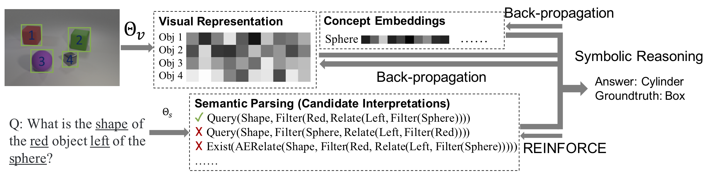

# THE NEURO-SYMBOLIC CONCEPT LEARNER

This repository contains the code and reproducibility [report](https://github.com/markvasin/nscl_reproducability_challenge/blob/master/NSCL_reproducability_challenge.pdf) for the [ICLR](https://iclr.cc/) 2019 paper - [The Neuro-Symbolic Concept Learner: Interpreting Scenes, Words, and Sentences From Natural Supervision](https://openreview.net/forum?id=rJgMlhRctm). This was done as part of the COMP6248 Reproducibility Challenge, a group coursework from Deep Learning class at University of Southampton.

## Paper Summary

[Mao et al.](https://openreview.net/forum?id=rJgMlhRctm) proposed Neuro-Symbolic Concept Learner, inspired by human learning process, to learn visual concepts and accurately answer questions on the [CLEVR dataset](https://cs.stanford.edu/people/jcjohns/clevr/). Their model achieved remarkable accuracy in visual concept learning, visual question answering, and generalised well to images with more objects and more complex questions. The model is composed of three parts: a visual module to extract features from the scene, a semantic parser to translate questions into programs, and a symbolic reasoning module to execute the program to obtain an answer and bridge the learning between a visual module and a semantic parser. The training strategy is also motivated by human learning. The author employed curriculum learning strategy to help with optimisation, where the questions and scenes are presented to the model with increasing difficulty.

## Library
- Python 3
- PyTorch
- NumPy

## Usage
1. Run download.sh to download all the necessary data
2. To train the model, run nscl_trainer.py
3. To evaluate the model on the validation set, run nscl_evaluator.py
4. To run concept classification experiment, use concept_classification_experiment.py
5. To run concept COUNT experiment, use concept_count_experiment.py
